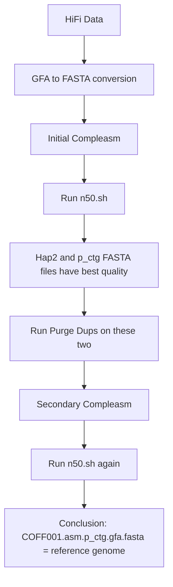
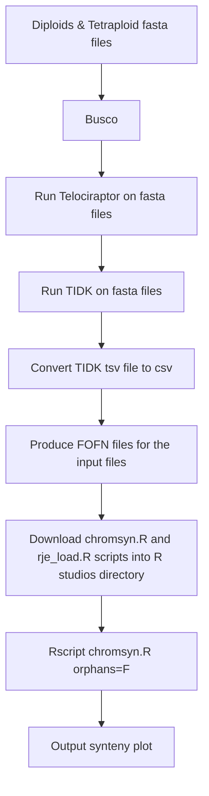

# Thesis-Project: Comparative Genomic Analysis of Cochlearia Officinalis and Diploid Cochlearia Species

This project involves the comprehensive analysis of genome assemblies for the autotetraploid species *Cochlearia officinalis*. Two types of HiFi assemblies were initially provided for the same species and their genome completeness was evaluated to determine the optimal assembly for downstream analysis. Quality assessments were conducted using Compleasm, N50.sh, and Purge Dups, leading to the selection of the best reference genome from six assemblies. This reference genome was then utilised for synteny analysis against various *Cochlearia* diploid species to identify the parent species through Chromsyn analysis, producing synteny plots for each diploid comparison. Additionally, leveraging a VCF dataset, we identified five autotetraploid populations of *C. officinalis* and conducted principal component analysis (PCA) with each tetraploid population against 26 diploid populations (145 individual samples) to assess geographical closeness and species relatedness. 

*C.officinalis* is the progenitor of the autopolyploid *C.anglica* and one of the parent species of the allohexaploid *C.hollandica* (Brandrud M K, 2014), therefore identifying the parental lineage of *C.officinalis* not only allows us to comprehend the genetic makeup of itself but also the genomes of its descendants. Previous studies have hypothesised that the diploid *C.pyrenica* is likely the progenitor of *C.officinalis*, yet the autotetraploid nature of *C.officinalis* presents challenges in identifying its parental lineage due to significant genome reorganisation which occurs in autopolyploids (Parisod et al., 2010). However, this multi-faceted approach aims to elucidate the genetic similarity/variations of *Cochlearia Officinalis* against other *Cochlearia* diploid species by employing whole genome synteny analysis and (PCA) to trace evolutionary history to ultimatley try and identify the parental lineage of *Cochlearia Officinalis*. 


## Inital HiFi Assembly Data
2 types of HiFi assembly data were provided from the same autotetraploid species to initally conduct genome completeness analysis and identify which assembly should be used for downstream analysis and comparison against the diploid species - The 2 types of HiFi assembly data include:

#### 1: HiFi Assembly of the C.Officinalis WITHOUT the --primary flag:
* COFF001.asm.bp.hap1.p_ctg.gfa
* COFF001.asm.bp.hap2.p_ctg.gfa 
* COFF001.asm.bp.p_ctg.gfa

#### 2: HiFi Assembly of the C.Officinalis WITH the --primary flag:
* COFF001.asm.p_utg.gfa
* COFF001.asm.p_ctg.gfa
* COFF001.asm.a_ctg.gfa

#### These GFA files were converted to FASTA format for downstream analysis: 
`awk '/^S/{print ">"$2;print $3}' input.gfa  > output.fa`


## Input VCF file which contains the populations required in the PCA:
* 4dg_s1to6_bi_best_snps_pruned.ann.vcf

In this VCF the relevant tetraploid populations that will be extracted and compared against 26 other diploid populations (145 individual samples) are:
* LNL Population - LNL_8
* ERS Population - ERS_2
* TRO Population - TRO_5
* ROT Population - ROT_7
* FTW Population - FTW_3

The populations identified and utilised in this study were from the Dataset S2 Sample Metrics - from supplementary dataset S2 of Bray et al., 2023: 
Sian Bray, Hamala T, Zhou M, Busoms S, Fischer S, Desjardins S D, Mandakova T, Moore C, Mathers T C, Cowan L, Monnahan P, Koch J, Wolf E M, Lysak M A, Kolar F, Higgins J D, Koch M A, Yant L (2023) Kinetochore and Ionomic Adaptation to Whole Genome Duplication. bioRxiv. [https://www.biorxiv.org/content/10.1101/2023.09.27.559727v1.full]

### PCA Script:

The script used to produce the PCA plots is the est_cov_pca.R script by Toumas Hamala, April 2024 - GitHub Repository: https://github.com/thamala/polySV.git
There are slight adjustments to the script that have been mentioned in the PCA Plot folder scripts - removal of the geom_repel line to remove the labels in one output as well as the adjustment of the ggtitle, axis.title size and plot.title size. 

#### Note:
The input files required for this analysis are genome fasta files which are too large to be shared on this GitHub page, therefore full permission has been granted to the location of these files on ada: /gpfs01/home/mzywj2

## Dependencies:
* Bcftools: Version 1.20
* Busco: Version 5.6.1
* Chromsyn: Version 1.3.0
* Compleasm: Version 0.2.6
* Conda: Version 24.5.0
* Gatk: Version 4.5.0.0
* Minimap2: Version 2.28
* Mummer4: Version 4.0.0
* Purge_dups: Version 1.2.6
* Samtools: Version 1.20
* Telociraptor: Version 0.8.0
* TIDK: Version 0.2.41

## Installations:

### Miniconda:
To your home directory produce a script for miniconda installation, once it has been produced it can be submitted through `sbatch` and follow the instructions on the screen
```
#!/bin/bash

Download and install Miniconda
wget https://repo.anaconda.com/miniconda/Miniconda3-latest-Linux-x86_64.sh -O Miniconda3-latest-Linux-x86_64.sh
bash Miniconda3-latest-Linux-x86_64.sh -b -p $HOME/miniconda -u

Configure Conda
$HOME/miniconda/bin/conda config --set auto_activate_base false
$HOME/miniconda/bin/conda config --set env_prompt '({name})'

Add Conda to your path permanently
echo 'export PATH=$HOME/miniconda/bin:$PATH' >> ~/.bash_profile
source ~/.bash_profile

```


Only after the conda environment has been created can the additional environments/software tools you require be added


### Busco:

BUSCO (Benchmarking Universal Single-Copy Orthologs) is used to assess the completeness of genome assemblies, gene sets, and transcriptomes. By evaluating the presence and integrity of conserved orthologs, BUSCO provides a quantitative measure of assembly quality. 

```

# Create a new Conda environment for BUSCO
conda create -y --name busco -c bioconda busco

# Activate the newly created environment
conda activate busco

```

##### It is important to mention that sometimes busco is difficult to install, in that it will install into the conda environment and have its own environment but sourcing busco and running a busco script sometimes produces an error stating "No module named 'busco'". If this situation occurs and it cannot be resolved, the busco command can be run directly on the command line instead of as a script and this should produce the relevant output.

The BUSCO lineages that will be used in this study is the brassicales-obd10 lineage, this will also be utilised for Compleasm Analysis. 

#### Example Usage:

` busco -i input.fasta   -o busco_output_name -l /path/to/the/busco_downloads/lineages/brassicales -m genome -c 8`


For further detail regarding BUSCO, refer to the BUSCO GitHub Repository: https://github.com/metashot/busco.git 

### Compleasm:

Compleasm is a high-performance tool for genome assembly, designed to efficiently handle large and complex datasets. It also provides more sensitivity than BUSCO. 

```

# Create the compleasm environment 
conda create -n compleasm_env -c conda-forge -c bioconda compleasm

# Activate the environment 
conda activate compleasm_env

```


#### Example Usage: 

`compleasm run -a /gpfs01/home/mzywj2/COFF001.asm.a_ctg.gfa.fasta -o /path/to/outdir -l brassicales -L /path/to/busco_downloads/lineages/brassicales-odb10  -t 32`


For further detail regarding Compleasm, refer to the Compleasm GitHub Repository: https://github.com/huangnengCSU/compleasm.git

### Minimap2:

Minimap2 is a sequence alignment tool that that maps DNA or mRNA sequences against large reference databases. Minimap2 supports various types of sequencing data, including long reads (PacBio, Oxford Nanopore) and short reads (Illumina).

```
# Create Minimap2 environment
conda create -y --name minimap -c bioconda minimap2

# Activate the environment
conda activate minimap

```

#### Example Usage:

`minimap2 -t 32 -x map-hifit input.fasta sequencing.fastq.gz | gzip -c - > minimap_output.paf.gz`


For further detail regarding Minimap2, refer to the Minimap2 GitHub Repository: https://github.com/lh3/minimap2.git


### Purge_dups:

Purge_Dups is a tool designed to identify and remove duplicate contigs from genome assemblies. By analysing read depth and sequence similarity, Purge_Dups effectively distinguishes between genuine duplications and assembly artifacts. This improves the quality and accuracy of genome assemblies.

```
# Create Purge_dups environment
Conda create -n purge_dups_env -c bioconda purge_dups=1.2.6

# Activate the environment
Conda activate purge_dups_env

```

#### Example Usage:

```
# Run minimap2 to get alignments
minimap2 -x map-hifi -t 32 assembly.fa reads.fastq.gz | gzip -c - > alignment.paf.gz

# Run purge_dups pipeline

# Generate statistics from the alignment
pbcstat alignment.paf.gz

# Calculate cutoffs based on the statistics
calcuts PB.stat > prefix_cutoffs

# Split the assembly
split_fa assembly.fa > split_assembly.fa

# Align reads to the split assembly
minimap2 -x map-hifi -t 32 split_assembly.fa reads.fastq.gz | gzip -c > split_alignment.paf.gz

# Purge duplicates based on the cutoffs
purge_dups -2 -T prefix_cutoffs -c PB.base.cov split_alignment.paf.gz > prefix_dups

# Get sequences after purging duplicates
get_seqs prefix_dups assembly.fa > purged_assembly.fa

```

For further detail regarding Purge dups, refer to the Purge dups GitHub Repository: https://github.com/dfguan/purge_dups.git

### N50.sh Script

This script is used to evaluate more quality metrics for the HiFi assemblies and this script is from: [https://github.com/hcdenbakker/N50.sh.git] 


### Mummer4:

MUMmer4 is designed for efficient and accurate alignment of large DNA or RNA sequences. It is commonly used to compare genomes or long-read sequencing data and it provides tools for aligning entire genomes, identifying similarities and differences, and visualizing genomic data.

```
# Create mummer4 environment 
conda create -n mummer4_env -c bioconda mummer4

# Activate the environment
conda activate mummer4_env

```

This step of the analysis also requires the installation of python and numpy in the mummer4_env (activate this environment first):

` conda install python`  
`conda install numpy`

#### Example Usage:

`nucmer --mum -l 100 -c 500 --prefix output_prefix reference.fa assembly.fa`

For further detail regarding MUMmer4, refer to the MUMmer4 GitHub Repository: https://github.com/mummer4/mummer.git 


### Samtools: 
Samtools allows users to perform a wide range of tasks, including sorting, merging, and indexing alignments, as well as variant calling and data visualisation. 

```
# Create samtools environment
conda create samtools -c bioconda samtools

# Activate the environment
conda activate samtools

```

#### Example Usage:

`samtools faidx reference.fasta scaffold_1_reference.fasta > new_scaf_1_reference.fasta`

### Telociraptor: 

Telociraptor is a genome assembly editing tool that predicts telomeres at the ends of assembly scaffolds. Telociraptor also generates an assembly map with contig positions and gap lengths, fixes scaffolding errors based on telomere predictions, and can produce outputs used by ChromSyn.

```

# Create a telociraptor environment
conda create -n telociraptor_env python=3.8

# Clone the GitHub page for it
git clone https://github.com/slimsuite/telociraptor.git

# Install the dependencies
pip install pandas biopython numpy

# Activate the environment
conda activate telociraptor_env

```

#### Example Usage:

```

# navigate to the directory that has the .py file and then run the command
python telociraptor.py -seqin /path/to/file/COFF001.asm.p_ctg.gfa.fasta -basefile C_off_chr1 i=-1 tweak=F telonull=T

```

- The  `telonull=T` is recommended to produce the relevant inputs for Chromsyn

For further detail regarding Telociraptor, refer to the Telociraptor GitHub Repository: https://github.com/slimsuite/telociraptor.git

### TIDK: 

Telomere Identification and Discovery Kit, is a toolkit designed for the identification and analysis of telomeres within genome assemblies and is also compatible with PacBio HiFi reads. It detects telomeric sequences, assess their integrity, and provide detailed reports on their locations and structures within the genome. The output of TIDK is also used by Chromsyn.

```
# Create the TIDK environment
conda create --name tidk_env -c bioconda tidk

# Activate the environment
conda activate tidk_env

```

#### Example Usage: 
`tidk search -s TTAGGG -o Cochlearia_off_whole -d /gpfs01/home/mzywj2 --extension tsv /path/to/file/COFF001.asm.p_ctg.gfa.fasta`

However, in order to use the output of TIDK as an input file for Chromsyn, the tsv output must be converted to a csv file: 

```
awk 'BEGIN {FS="\t"; OFS=","} {$1=$1} 1' Cochlearia_off_whole_telomeric_repeat_windows.tsv > Cochlearia_off_whole_telomeric_repeat_windows.csv

```

For further detail regarding TIDK, refer to the TIDK GitHub Repository: https://github.com/tolkit/telomeric-identifier.git

### Chromsyn:

Chromsyn is an R studios tool used for the comparative analysis and visualization of chromosome synteny, which refers to the preserved order of genes on chromosomes of different species or within different assemblies of the same species.It helps in identifying and analysing regions of conserved gene order, structural variations, and rearrangements between genomes.

Since Chromsyn is used in R, it does not have specific installation steps, however if these instructions below are followed, Chromsyn will run without error: 
- Create a directory in R
- Ensure the rje_load.R and chromsyn.R files (available from https://github.com/slimsuite/chromsyn.git) are placed in the created directory
- Place all the input files in the same directory
- Ensure the genome input file names are consistent for each one e.g. if it is for the C_officinalis genome, ensure all the input files start with C_officinalis

#### Input files for Chromsyn:
- Busco full_table.tsv output file - alter the file name to $genome_busco5.tsv ($genome: change the prefix respectively for each genome you analyse e.g. C_officinalis_busco5.tsv)
- Telociraptor *gaps.tdt and *telomeres.tdt - alter the prefix of the file name respectively for each genome
- TIDK output tsv converted to a csv - *telomeric_repeat_windows.csv - alter the prefix of the file name respectively for each genome
- FOFN (file of file names) files for each of the input files - busco.fofn, gaps.fofn, sequences.fofn (for the *telomeres.tdt files) and tidk.fofn. If, as recommended above all the input files are placed in the same directory as the chromsyn.R script then the fofn file layout should look like this:

C_officinalis C_officinalis_telomeric_repeat_windows.csv

C_groenlandica C_groenlandica_telomeric_repeat_windows.csv
- However, if you chose to place the input files in a different directory then the paths to those files should be written in the fofn file e.g:
C_officinalis /absolute/path/to/the/file/C_officinalis_telomeric_repeat_windows.csv

#### To run chromsyn:

In the R terminal (not the console), run the command `Rscript chromsyn.R`
- If the output pdf or png file do not produce an image of a proper synteny plot (as the example given in the Chromsyn GitHub page), then re-run the command with this addition: `Rscript chromsyn.R orphans=F` (Personally recommended to me by the creator of the tool, Richard Edwards)
- The `orphans=F` argument removes from the plot any sequences that do not have syntenic regions, it will remove all the short contigs/scaffolds that lack BUSCO genes. Since the genomes used in this study were very large and more diverse than expected, this argument was required to produce a proper synteny plot


- An additional output file of Chromsyn is the excel file for each run which contains information about the busco genes and the hit lengths for the synteny analysis. In this project, for each analysis the total hit lengths from the Regions sheet of the file, were calculated to provide a quantitative measure of the proportion of synteny that was present between each genome comparison.

  
For further details regarding Chromsyn, refer to the Chromsyn GitHub Repository: https://github.com/slimsuite/chromsyn.git

### Bcftools:

BCFtools is a suite of utilities for processing and analyzing variant call format (VCF) and binary variant call format (BCF) files. It provides various functionalities including filtering, merging, and querying of VCF/BCF files. It is efficient and capable of handling large datasets.

```

# Create the bcftools environment
conda create --name bcftools -c bioconda bcftools

# Activate the environment
conda activate bcftools

```

In order to produce a list of the populations that are present in the vcf:
`bcftools query -l input.vcf`


### Gatk:

The Genome Analysis Toolkit, is a comprehensive software package developed for analysing high-throughput sequencing data.GATK provides a wide range of tools for tasks such as data pre-processing, quality control, variant calling, and variant filtering.

```

# Create the bcftools environment
conda create -y --name gatk_env -c bioconda gatk4

# Activate the environment 
conda activate gatk_env

```

#### Example Usage:

```
gatk SelectVariants \
-V /path/to/vcf file/4dg_s1to6_bi_best_snps_pruned.ann.vcf \
-sn LNL_8 \
-sn ARN_1 -sn ARN_2 -sn ARN_3 -sn ARN_4 \
-sn AUV_1 -sn AUV_2 -sn AUV_3 -sn AUV_4 -sn AUV_5 -sn AUV_6 -sn AUV_7 -sn AUV_8 \
-O /output/directory/path/LNL_filtered.vcf

```

`-V` - input.vcf
`-sn` - sample/population name
`-O` - output.vcf


## Pipeline for Initial HiFi Assembly Data Quality Assessment and Choosing the Reference Genome for *Cochlearia Officinalis*:





## Pipeline for the comparison of other *Cochlearia* species against the *C Officinalis* reference genome:
#### This is for the comparison of the autotetraploid *Cochlearia Officinalis* against the diploid species individually for each species: Cochlearia Pyrenica, Cochlearia Groenlandica, Cochlearia Excelsa and Cochlearia Aestuaria



## Acknowledgments: 

Chromysn:
- A special thank you to Richard Edwards for personally helping with correcting issues that were encountered when trying to run Chromsyn.

Compleasm: Huang N, Li H. (2023) Compleasm: a faster and more accurate reimplementation of BUSCO. *Bioinformatics*. Volume 39, Issue 10. [https://academic.oup.com/bioinformatics/article/39/10/btad595/7284108?login=false]

N50.sh: [https://github.com/hcdenbakker/N50.sh.git]

Brandrud M K (2014) Polyploidy and Ecotypic Variation in Cochlearia Officinalis L. and Related Species. Master of Science Thesis. Department of Biosciences, University of Oslo. [https://core.ac.uk/download/pdf/30902961.pdf]

Parisod C, Holderegger R and Brochmann C (2010) Evolutionary Consequences of Autopolyploidy. New Phytologist. Volume 186, Issue 1, Pgs. 5-17. [https://doi.org/10.1111/j.1469-8137.2009.03142.x]
